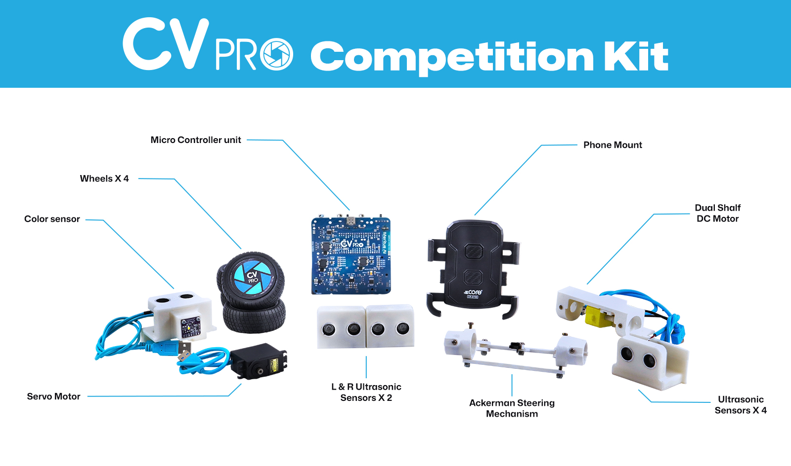

## COMPETITION KIT
<p align="center" width="100%">
    
</p>

The CV Pro Competition kit is crafted for the future engineers who compete in various competitions, opening the door to the realm of autonomous technology, and enabling exploration in the sphere of cutting-edge innovations.The kit empowers users with functionalities including color sensors and ultrasonic sensors for color detection and obstacle avoidance during navigation. It can effectively monitor its surroundings using these sensors and even follow a specified color path when programmed accordingly. Our CV Pro competition kit seamlessly integrates with Android mobile phones for optimal compatibility and performance.

## You can download the APK from this [link](https://drive.google.com/drive/u/0/folders/1uq9PmImZiYLncMbVU259YYULkfPL1bhg)

## Get the source code

- You can download the repository as a [zip file](https://github.com/robotixdevteam/CVPro_Competition_Kit/archive/refs/heads/master.zip) and extract it into a folder of your choice.
- You can clone the CVPRO-Competition-Kit repository from GitHub with the following command:

    ```bash
    git clone https://github.com/robotixdevteam/CVPro_Competition_Kit
    ```

## Mechanical Parts
<p align="center" width="100%">
    
</p>

## Hardware - PCB Ports and Usages
<p align="center" width="100%">
    
</p>

## Modules and components

**`Note`**: For the board installation and setup in the [Arduino IDE](https://www.arduino.cc/en/software).

### ESP32 Board

<p align="center" width="100%">
    
</a>

The PCB contains an ESP32 as a controller. It is a versatile microcontroller, combining a dual-core processor with built-in Wi-Fi and Bluetooth capabilities. It's highly efficient and ideal for various IoT applications. Its dual-core architecture supports multitasking, making it efficient for both processing and communication tasks. With a wide range of GPIO pins, it's flexible for interfacing with sensors, motors, and other devices. Additionally, its low power consumption and compatibility with numerous development platforms make it a popular choice for IoT projects and beyond. __Important Note:__ To install the ESP32 board in your Arduino IDE, follow the [link](https://randomnerdtutorials.com/installing-the-esp32-board-in-arduino-ide-windows-instructions/)

### I2C Color Sensor

<p align="center" width="100%">
    
</a>

An I2C color sensor is a device that detects and measures colors using the I2C communication protocol. It typically integrates various photodiodes, filters, and electronics to accurately perceive and differentiate different colors. By utilizing an I2C color sensor in this project, you can detect and measure colors accurately, enabling a wide range of applications that require color analysis and processing.

Applications: I2C color sensors find applications in a variety of fields, including industrial automation, consumer electronics, robotics, healthcare, automotive, and more. They are used for color sorting, color matching, display calibration, and various other color-related applications.

### HC - SR04 Ultrasonic Sensor

<p align="center" width="100%">
    
</a>

The HC-SR04 Ultrasonic Sensor is a widely used device for measuring distances based on the time it takes for ultrasonic waves to bounce back from an object. It consists of a transmitter that emits ultrasonic waves and a receiver that detects the waves. By calculating the time between emission and reception, the sensor determines the distance from the object. With a measurement range of 2 cm to 400 cm, Easy to interface with microcontrollers, the HC-SR04 sensor offers reliable and accurate distance measurements, making it a popular choice in the electronics and robotics communities.

### PCB inbuilt functions

1. Charging and discharging - _Charging will only be enabled if the bot is in `OFF` state_.
2. **`Green LED`** will indicate when the bot is fully charge in off state. (Ensure that bot runs for 50 minutes from time of full charge condition).
3. Li-ion `3.7V` single cell `3200mAh`.
4. Power module for powering the board, sensors and motors
5. Motor driver for controlling the motor
6. ESP32 micro controller for executing both wired and wireless communications and algorithms. The programming can be done through the given Type-C port. 

<p align="center" width="100%">
    
</p>


## Port and Pin Details 
### Table 
|    ***Function***   |  ***Port Type***    |  ***Port No*** |                      ***GPIO Pins***               |  
|:-------------------:| :-----------------: | :------------: | :-------------------------------------------: | 
|***Motor (Battery Operated Motor)***|    ***USB 3.0***    |   ***1***      |    ***32,33***     |
|***F1US & F2US (Front 1 & Front 2 Ultrasonic Sensors)***|    ***USB 3.0***    |  ***2***  |  ***F1-16,14 and F2-25,26***   |
|***BUS (Back Ultrasonic Sensor)***|***USB 3.0*** |   ***3***      |    ***17,19***    | 
|***SM (Servo Motor)***|  ***USB 3.0***  |  ***4***  |  ***27***  | 
|***RUS & LUS (Right & Left Ultrasonic Sensors)***|    ***USB 3.0***    |  ***5***  |  ***Right-2,23 and Left-5,18***   |
|***FUS (Front Ultrasonic Sensor)***|    ***USB 2.0***    |  ***6***  | ***12,4***  | 
|***CS (Color Sensor)***|   ***USB 2.0***    |  ***7*** |  ***22,21***   | ***-*** |
|***RGB LED***|  ***-***  |  ***-***  |    ***15***   | ***-*** |
|***NSLEEP For Motor***|  ***-***  |  ***-***  |    ***13***   | ***-*** |
|***Battery Voltage Reading***|  ***-***  |  ***-***  |  ***39***  | ***-*** |
|***DPDT Push Button***|  ***-***  |  ***-***  |  ***34***  | ***-*** |
|***Optical Encoder***|  ***-***  |  ***-***  |  ***36***  | ***-*** | 


Kindly refer to the pins provided in the [above table](#Table) for programming firmware.

### Constraints
1. Ensure that every USB cable is connected to its designated port as specified.
2. The kit's servo angle is fixed at **100 degrees**.
3. The PCB lacks protective covering; avoid placing conductive materials on it.
4. When adjusting the angle, stay within a **20-degree** range to the __left and right of the center angle (100 degrees)__, which allows movement between **80** and **120 degrees**. Deviating beyond these limits may result in damage to the product.
5. Handle with care to avoid wire wear.

# Software Requirements:

### CVPRO Competition Kit: Installation and Setup Guide - Windows: 
1. Download the Source Code.
    1. Navigate to CVPro Competition Kit GitHub Repository.
    2. Download the repository as a ZIP file.
    3. Extract the contents of the ZIP file to your User Profile Path (e.g., C:\Users\<YourUsername>).
2. Launch the Application.
    1. Locate and double-click the **"CVPRO"** file in the extracted folder.
    2. A security dialog box will appear.
    3. Click More Info.
    4. Select Run Anyway to proceed.
3. Library Installation.
    1. Upon launching, the CVPRO terminal opens with the title **"CVPRO Competition Kit"**.
    2. The terminal will begin installing the necessary libraries for the application.
    3. Wait for the installation to complete. The terminal will automatically redirect you to the test codes folder once the process finishes.
4. Setup for Arduino Users.
    1. If you are a new Arduino user, ensure the ESP32 boards are installed in your Arduino IDE:
    2. Open the Arduino IDE.
    3. Go to File > Preferences.
    4. Add the following URL to the Additional Board Manager URLs: https://raw.githubusercontent.com/espressif/arduino-esp32/gh-pages/package_esp32_index.json;https://dl.espressif.com/dl/package_esp32_index.json
    5. Navigate to Tools > Board > Boards Manager.
    6. Search for ESP32 and install the required boards.
Once the setup is complete, select and upload the test code of your choice to your ESP32 board.

### CVPRO Competition Kit: Installation and Setup Guide (Mac)
1. Download the Source Code.
    1. Navigate to CVPro Competition Kit GitHub Repository.
    2. Download the repository as a ZIP file.
    3. Extract the contents of the ZIP file to your Home directory (e.g., $HOME).
2. Launch the Application.
    1. Open a terminal window.
    2. Navigate to the extracted folder and launch the application using one of the following commands:
        **./cvpro.zsh** or **source cvpro.zsh**
    3. No security dialogs will appear.
3. Library Installation.
    1. The CVPRO terminal opens with the title "CVPRO Competition Kit".
    2. The terminal will begin installing the necessary libraries for the application.
    3. Wait for the installation to complete. The terminal will automatically redirect you to the test codes folder once the process finishes.
4. Setup for Arduino Users.
    1. Follow these steps to install the ESP32 boards:
    2. Open the Arduino IDE.
    3. Go to Arduino > Preferences.
    4. Add the following URL to the Additional Board Manager URLs: https://raw.githubusercontent.com/espressif/arduino-esp32/gh-pages/package_esp32_index.json;https://dl.espressif.com/dl/package_esp32_index.json
Once the setup is complete, select and upload the test code of your choice to your ESP32 board.

### Download and install Arduino IDE: 

Follow the instructions in this link: https://support.arduino.cc/hc/en-us/articles/360019833020-Download-and-install-Arduino-IDE.

### For Windows:
1. Go to Arduino Website https://www.arduino.cc/en/software. Click **Windows Win 10 and newer, 64 bits** and download the Arduino IDE application and Install.
2. If you encounter any CP210x driver issues, go to the silicon labs website https://www.silabs.com/developers/usb-to-uart-bridge-vcp-drivers?tab=downloads. Click **CP210x Universal Windows Driver** and download the driver and Install.
3. Open the Arduino IDE application, select "**Tools**" then go to "Upload Speed" and set the upload speed to "115200".

### For MAC OS:
1. Go to Arduino Website https://www.arduino.cc/en/software. Click **macOS Intel, 10.15: “Catalina” or newer, 64 bits** and download the Arduino IDE application and Install.
2. If you encounter any CP210x driver issues, go to the silicon labs website https://www.silabs.com/developers/usb-to-uart-bridge-vcp-drivers?tab=downloads and Click **CP210x VCP Mac OSX Driver** and download the driver and Install.
3. Open the Arduino IDE application, select "**Tools**" then go to "Upload Speed" and set the upload speed to "115200".

### For Ubuntu Linux OS:
1. Go to Arduino Website https://www.arduino.cc/en/software. Click **Linux AppImage 64 bits (X86-64)** and download the Arduino IDE AppImage file.
2. Find the AppImage file in your file manager.
3. Make the AppImage file executable:
    1. Right-click the file.
    2. Choose Properties,
    3. Select the Permissions.
    4. Tick the Allow executing file as program box.
4. Double-click the AppImage file to launch Arduino IDE.

### Libraries to be installed in Arduino IDE.
1. Go to Board Manager and type `esp32`, Select Version `2.0.17` and install.
2. Go to Library Manager and type `NewPing`, Select Version `1.9.7` and install.
3. Go to Library Manager and type `FastLED`, Select Version `3.7.0` and install.
4. Go to Library Manager and type `ESP32Servo`, Select Version `1.2.1` and install.
5. Go to Library Manager and type `Adafruit TCS34725`, Select Version `1.4.4`and install.

# Upload Firmware to the Kit

To start, upload the `CVPRO_Competition_Firmware` into the competition kit, from the Firmware folder in your `CVPRO_Competition_Kit` repository.

## How to connect the Phone and CV Pro Competition kit using connecting cable?

1. Connect the female-end of Type-C-OTG cable with male-end of Type-C-USB cable to establish a link.
2. Connect the Type-C end of Type-C-OTG cable with phone.
3. Connect the Type-C end of Type-C-USB cable with Type-C port on the PCB board.
4. If the connection process is correct, it will seek for permissions on your phone.

## Contact

- Contact us via [Email](mailto:support@meritus.ai)


